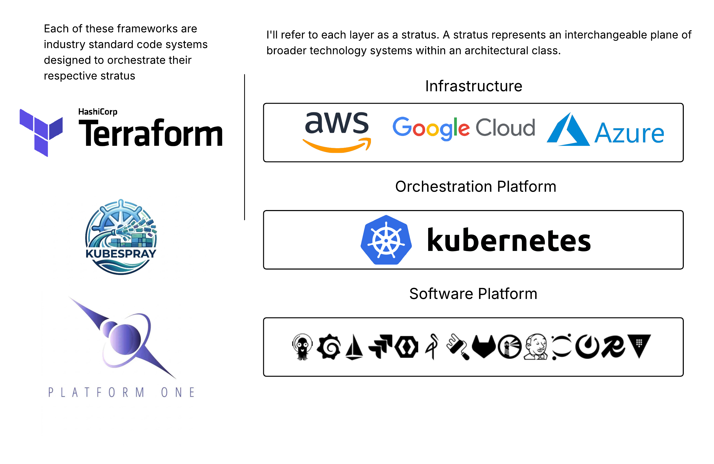
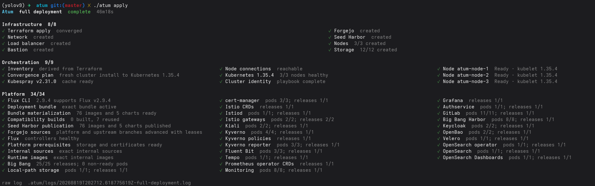

<p align="center">
  
</p>

---
Atum is a declarative Go CLI for deploying the Department of Defense (War?) platform [The Big Bang](https://github.com/DoD-Platform-One/bigbang) without access to their Iron Bank images.
---
<p align="center">
  
</p>
<br>

# It's Just a Fancy Wrapper

Big Bang is a platform in a box. The deployment model is open source and openly licensed, but access to its specialty images is restricted. This repo handles a few things on that front. But it's still just a wrapper around battle-tested software platforms. So if something goes wrong, you're not troubleshooting Atum, you're troubleshooting industry-standard, production-proven deployment platforms.

1. All images are swapped out for their official upstreams and built from scratch where there is no analog or the upstream was sunset.
2. It's all fully declarative. Big Bang itself is a Helm chart of Helm charts. Nothing is vendored to this repo. The platform is mostly value overrides with minimal Flux/Kustomize wiring.
3. As of this writing, it uses Kubespray for the cluster. Lean into it. Own the cluster. I may add support for cloud-native Kubernetes implementations in the future, but this handles upgrades and deployment using Ansible with Mitogen. I'm also out of money in a big way.
4. It's air-gap ready. It bundles all images into an OCI bundle for deployment. It stands up a provisional [Harbor](https://github.com/goharbor/harbor)/[Forgejo](https://forgejo.org/) combo on the bastion for first-time deployment.

# Infra, Orchestration, Platform

Converging three planes:

- Terraform-managed infrastructure.
- Ansible/Kubespray-managed Kubernetes.
- Flux-managed Big Bang platform software.

The repository contains the Atum-owned configuration, overlays, compatibility
entrypoints, and build graph. It does not require root `bigbang`, `kubespray`,
or `bitnamilegacy-charts` checkouts. Immutable upstream snapshots are hydrated
into the ignored `.atum/cache` tree from the commits in [`atum.json`](atum.json).

### One command, an entire enterprise-grade platform

<p align="center">
  
</p>

# Quickstart

```sh
git clone https://github.com/rlewkowicz/atum.git && cd atum
CGO_ENABLED=0 go build -trimpath -ldflags='-s -w' -o atum ./cli/atum
go version -m ./atum
sha256sum ./atum
install -m 0755 atum "$HOME/.local/bin/atum"
atum pull updates
atum secrets init --local
atum secrets render
atum apply
```

### Work in progress

You need a pretty beefy rig to run the local install. It's literally an entire enterprise platform. There are also failure modes I haven't explored. I'm not even certain how the CLI bubbles up errors if you don't have enough resources. I'm polishing the edges, but the base functionality works, and is worth exploring.

## Install

The complete local flow needs Go 1.26+, Terraform, Docker with Buildx/BuildKit,
Python 3.11+, OpenSSH, [SOPS](https://github.com/getsops/sops/releases),
[Flux](https://fluxcd.io/flux/installation/), QEMU/KVM, and system libvirt.
Only local libvirt is supported end to end today.

Atum's preflight tells you which dependencies are missing before it changes
anything.

## Declarative state

[atum.json](atum.json) contains site intent plus updater-owned selected facts.
[atum.lock.json](atum.lock.json) binds that document to exact Git commits,
chart archives, image digests, build inputs, and compatibility constraints.

Review updater output before deployment:

```sh
atum pull updates --check
atum pull updates
git diff -- atum.json atum.lock.json platform
```

## Secrets

For a shared SOPS document:

```sh
atum secrets init --age-recipient age1example...
atum secrets validate
atum secrets render
```

For local development:

```sh
atum secrets init --local
atum secrets validate
atum secrets render
```

Never commit the local file beneath `.atum/`. Rendered Kubernetes Secrets are
SOPS-encrypted under `platform/secrets/<cluster>/`; Flux reads them from this
repo. The SOPS decryption-key Secret is the only imperative cluster object.

## Local host setup

Use these only if your host needs them:

```sh
sudo "$(command -v atum)" infra libvirt permissions install
sudo "$(command -v atum)" infra libvirt forwarding install
```

`--raw` streams the underlying tools. It does not change what `apply` does:

```sh
atum --raw apply
```

Destroy prompts for the exact response `yes`; `--force` bypasses the prompt:

```sh
atum destroy
atum destroy --force
```

## Plane commands

```sh
atum infra plan
atum infra apply
atum infra terraform <terraform-args...>

atum orchestration prepare
atum orchestration inventory
atum orchestration plan
atum orchestration apply --become
atum orchestration upgrade --become
atum orchestration ansible <ansible-playbook-args...>

atum platform prepare
atum platform apply
atum platform status
atum platform flux <flux-args...>
```

## Image delivery

```sh
jq -r '.delivery.images[] | [.id, .delivery.default.type, .target] | @tsv' atum.json
atum images bundle
```

## Status

```sh
atum platform status
atum infra access status
```

## Backup and restore

```sh
atum platform velero backup create platform
atum platform velero backup get
atum platform velero restore create --from-backup platform
```

## More detail

- [Architecture and ownership contract](CONTRACT.md)
- [Selected packages and image decisions](platform/docs/finalpackages.md)
- [Local libvirt setup](infra/libvirt/README.md)
- [Kubespray patches](orchestration/patches/README.md)
